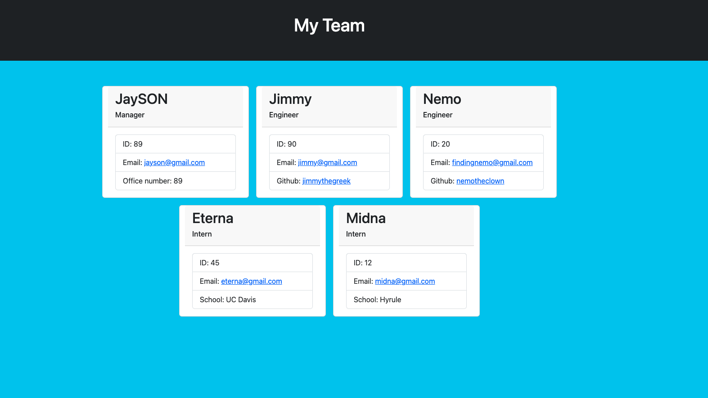

# Team-Profile-Generator

## Description

Application generates a team via Node "Inquirer" package. User is able to create a team consisting of a manager, engineers, and interns from the command line interface. When the team is finished and generated, an "index.html" file is created and can be viewed in a browser. User is able to click on links on team members' cards that can let the user email the team member or view their Github profile. The webpage is also fully responsive to all screen sizes.

## Table of Contents:

- [Description](#description)
- [Installation](#installation)
- [Usage](#usage)
- [Tests](#tests)
- [Questions](#questions)

## Installation:

User must clone this repository onto their computer is recommended for installation. The use of Node.js with "Inquirer Version 8.2.4" is required for the application to function.

## Usage:

Creates a team consisting of a manager, engineers, and interns with their information.

## Tests:

Run the following commands in your terminal to test this app:
"npm test" is required to test if Javascript functions are working properly

## Questions:

If you have any questions, you may contact me at either

- Github: https://github.com/dmilleza
  or
- Email: darrenmilleza@gmail.com
